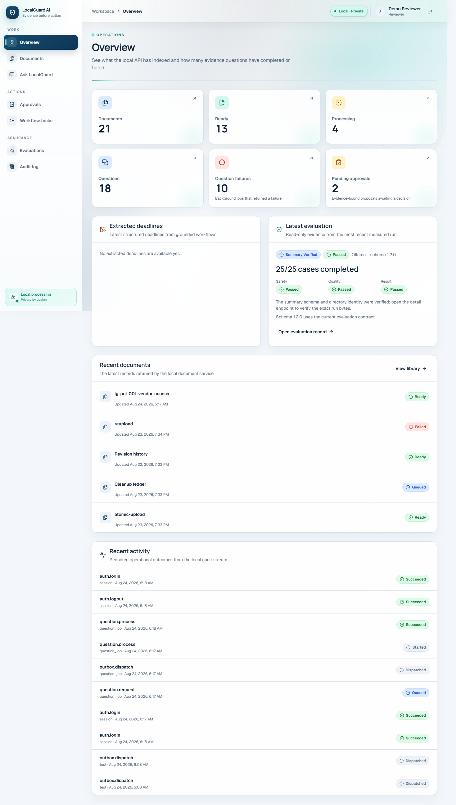
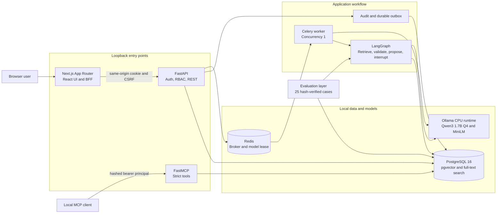

<div align="center">


# LocalGuard AI

**Local-first document intelligence where every answer resolves to source proof and every action waits for human approval.**

[](https://github.com/Hasan-Al-Hussein/localguard-ai/actions/workflows/ci.yml)


[](LICENSE)

[Architecture](docs/architecture.md) · [Security](docs/security.md) · [Evaluation](docs/evaluation.md) · [Windows quick start](README-WINDOWS.txt)

</div>

LocalGuard AI ingests PDF, DOCX, and TXT files, preserves immutable source locations, and answers
questions through hybrid retrieval and evidence-confirmed bindings. An action request becomes an
inert proposal, pauses in LangGraph, and cannot create a task until an authenticated reviewer
approves the bound version, payload, evidence snapshot, and expiry.

The standard runtime stays on one Windows computer. Generation and embeddings use pinned Ollama
models, PostgreSQL with pgvector is authoritative, and the application needs neither a paid model
API nor a GPU. This is an engineering demonstration, not legal advice or a production compliance
system.

## Evidence at a glance

| Signal | Verified release evidence |
|---|---|
| Local-model evaluation | 25/25 hash-verified cases completed under schema 1.2.0 and dataset 1.0.2 |
| Grounding | 1.0000 macro and pooled citation precision, zero unsupported claims in the measured corpus |
| Human approval | 7/7 approval transitions, with zero preapproval tasks or executions |
| Adversarial controls | 5/5 insufficiency abstentions, 27/27 injection controls, 97/97 forbidden controls |
| Deterministic quality gates | 383 Python unit/security tests, 45 integration tests, and 46 frontend tests passed locally |
| Product evidence | Seven guarded, full-page screenshots from the validated local workflow |

These are bounded results from the documented synthetic corpus and target CPU-only laptop. They are
not production, legal, or general model-accuracy claims.

## The problem

Operational documents contain deadlines, responsibilities, exceptions, and required actions.
Finding a plausible answer is easy; proving where it came from and controlling what happens next
is harder. LocalGuard treats those concerns as application responsibilities:

- citations resolve to immutable document revisions and exact source ranges;
- uploaded text is untrusted evidence, never an instruction or approval channel;
- roles and tool access are enforced outside the model;
- action requests stop at a version-bound approval record;
- retrieval, model output, tools, approvals, retries, and failures leave an audit trail.

## What I engineered

- Built the source-preserving PDF, DOCX, and TXT ingestion path with immutable revisions, stable
  anchors, local embeddings, pgvector search, PostgreSQL full-text search, and reciprocal-rank
  fusion.
- Designed evidence-binding contracts where the application scopes and derives facts while the
  local model confirms a valid binding or abstains.
- Implemented the LangGraph human-review interrupt, version and hash binding, role revalidation,
  durable audit trail, and database-enforced exactly-once task creation.
- Developed the FastAPI, Next.js, Celery, FastMCP, migration, packaging, test, browser, and
  evaluation surfaces that make the full local workflow reproducible.

## What is implemented

| Area | Current behavior |
|---|---|
| Document intake | Validates PDF, DOCX, and TXT by extension, declared type, detected content, size, and format-specific limits |
| Source preservation | Stores immutable revisions with real PDF pages, DOCX structural anchors, or TXT line ranges |
| Retrieval | Combines exact pgvector cosine search and PostgreSQL full-text search with reciprocal-rank fusion |
| Answering | Uses a sufficient-evidence gate, model confirmation of opaque exact-marker bindings, and application-derived answers, claims, and server-resolved citations under `qa-fact-binding-v1` |
| Extraction | Supports unambiguous modal obligations and deadlines plus the immediate-when-safe required-action shape, with actor/action/deadline fields |
| Extraction boundary | Under `evidence_derived_binding_confirmation_v2`, the application scopes the complete supported evidence-binding set, the model confirms that set or abstains, and the application derives every finding field. Standalone risk and party extraction are unsupported roadmap capabilities |
| Agent workflow | Runs an explicit LangGraph classify, retrieve, assess, generate, validate, propose, interrupt, and resume flow. For actions, `evidence_derived_binding_selection_v2` lets the model select one evidence binding while the application derives claim and proposal fields |
| Human approval | Binds proposal version, payload hash, evidence hash, expiry, actor, and graph thread before one task may be created |
| MCP | Exposes five schema-validated, RBAC-aware, audited FastMCP tools on loopback |
| Reliability | Uses a PostgreSQL outbox, idempotent Celery work, stale-claim recovery, cleanup retries, and correlation IDs |
| Evaluation | Uses evaluator schema `1.2.0` and the final audited, hash-verified dataset v1.0.2 corpus against either a deterministic provider or the pinned Ollama provider |
| Product UI | Includes overview, documents, viewer, ask, approvals, tasks, evaluations, and audit screens |

## Screenshots

Seven full-page screenshots were captured atomically by the guarded Playwright portfolio journey
from the live Ollama stack and the passing schema 1.2.0 evaluation. The journey revalidated the
demo artifact, fresh cited answer, proposal boundary, exactly-one task, audit chain, model digests,
corpus hashes, and evaluation run before publishing the images.

| Local operational state | Grounded answer and source binding |
|---|---|
|  |  |

| View | Evidence |
|---|---|
| [Overview](docs/screenshots/overview.png) | Live operational state and the verified 25/25 Ollama result |
| [Grounded answer](docs/screenshots/ask-cited-answer.png) | Fresh Qwen answer with application-resolved citation |
| [Exact citation](docs/screenshots/document-citation.png) | Immutable revision, page anchor, offsets, and highlighted source bytes |
| [Pending approval](docs/screenshots/approval-pending.png) | Evidence-bound inert proposal before execution |
| [Approved task](docs/screenshots/task-executed.png) | One approved task with proposal provenance |
| [Audit chain](docs/screenshots/audit-event.png) | Request, analysis, proposal, decision, resume, and task causality |
| [Evaluation detail](docs/screenshots/evaluation-ollama.png) | Runtime models, corpus identities, provenance, metrics, and all 25 cases |

## Architecture



PostgreSQL is authoritative. Redis contains replaceable broker state and the cross-process model
lease. Web, API, and MCP ports bind to `127.0.0.1`; PostgreSQL, Redis, and Ollama are not published
to the host. Model downloads use a separate temporary Compose overlay, then Ollama returns to the
internal network.

The longer design discussion is in [docs/architecture.md](docs/architecture.md).

## Technology

| Layer | Main components |
|---|---|
| Web | Next.js 16, React 19, TypeScript 5.9, Tailwind CSS 4, TanStack Query and Table, React Hook Form, Zod, Recharts |
| API | Python 3.12, FastAPI, Pydantic 2, SQLAlchemy 2, Alembic |
| Agent and tools | LangGraph, PostgreSQL checkpoints, FastMCP 3, strict structured outputs |
| Local AI | Ollama 0.32, `qwen3:1.7b-q4_K_M`, `all-minilm:22m-l6-v2-fp16` embeddings |
| Storage and jobs | PostgreSQL 16, pgvector, full-text search, Redis, Celery |
| Verification | Pytest, Ruff, strict mypy, Vitest, Testing Library, Playwright, actionlint |
| Runtime | Docker Compose, digest-pinned service images, PowerShell 7 scripts |

Exact package versions are locked in `requirements.lock`, `package-lock.json`, and
[docs/runtime-lock.json](docs/runtime-lock.json).
The current application-schema head is Alembic revision `20260823_0004`.

## Run it on Windows

### Prerequisites

- PowerShell 7 (`pwsh`)
- Docker Desktop using the Linux container engine
- Node.js `24.13.x` and npm `11.6.x`
- Internet access for the first dependency, image, and model download

The target machine has 16 GB RAM, an Intel CPU with integrated graphics, and no CUDA device. Host
Python, PostgreSQL, Redis, Celery, and Ollama are not required.

For the packaged Windows release, extract the ZIP and double-click `START-LOCALGUARD.cmd`. The
launcher checks the package, offers to install missing free prerequisites, generates local-only
credentials, starts the stack, and opens the app. See `README-WINDOWS.txt` in the package for the
resumable first-run flow and hardware requirements.

If Docker Desktop or Node.js is missing, the free installation commands are:

```powershell
winget install --exact --id Docker.DockerDesktop
winget install --exact --id OpenJS.NodeJS.LTS
```

### First setup

Open PowerShell 7 in the repository root:

```powershell
pwsh -File .\scripts\bootstrap.ps1
pwsh -File .\scripts\dev.ps1
```

Bootstrap performs locked npm installation, pulls the database and Redis images, builds the
application images, checks the live OpenAPI snapshot, applies and checks migrations, creates
LangGraph checkpoint tables, seeds demo users, and verifies the pinned local model manifests. It
creates an ignored `.env` with random local credentials and does not print their values.

Open [http://localhost:3000](http://localhost:3000). Demo usernames are `demo-admin`,
`demo-reviewer`, and `demo-viewer`; read the matching password from the local ignored `.env`.
Development-only FastAPI docs are available at [http://localhost:8000/docs](http://localhost:8000/docs).

### Normal commands

| Task | PowerShell command |
|---|---|
| Start or update the local stack | `pwsh -File .\scripts\dev.ps1` |
| Stop containers and keep data | `pwsh -File .\scripts\stop.ps1` |
| Run all configured test suites | `pwsh -File .\scripts\test.ps1 -Suite all` |
| Run unit checks only | `pwsh -File .\scripts\test.ps1 -Suite unit` |
| Run PostgreSQL and Redis integration tests | `pwsh -File .\scripts\test.ps1 -Suite integration` |
| Run both browser suites | `pwsh -File .\scripts\test.ps1 -Suite e2e` |
| Run deterministic evaluation | `pwsh -File .\scripts\evaluate.ps1 -Provider fake` |
| Run real local-model evaluation | `pwsh -File .\scripts\evaluate.ps1 -Provider ollama` |
| Reset and run the real demo proof | `pwsh -File .\scripts\demo.ps1 -Reset` |
| Measure authenticated indexing of all 13 fixtures | `pwsh -File .\scripts\benchmark-index.ps1` |
| Rotate the local demo-admin password | `pwsh -File .\scripts\rotate-demo-admin.ps1` |
| Rotate the local MCP bootstrap bearer | `pwsh -File .\scripts\rotate-mcp-token.ps1` |

The scripts stop on failure and preserve project volumes. They do not prune unrelated Docker data.
Unit, integration, and browser suites inject deterministic providers. Real Ollama behavior is
covered separately by the demo and local-model evaluation commands.
See [docs/troubleshooting.md](docs/troubleshooting.md) for bounded recovery steps.

## Five-minute demo path

1. Sign in as `demo-reviewer` and upload
   `fixtures/documents/clean/lg-pol-001-vendor-access.pdf`.
2. Wait for the revision to become ready, then open its preserved page text.
3. Ask: `How long does the Service Desk have to disable a vendor account after it receives an offboarding notice?`
4. Open the citation and inspect the exact stored passage containing the one-hour requirement.
5. Submit the action request from [docs/demo-script.md](docs/demo-script.md), then confirm that the
   proposal exists while the matching task count is zero.
6. Approve the bound proposal as a reviewer and confirm that exactly one task appears. A replay must
   return a conflict and must not create a second task.
7. Follow the correlation and workflow thread in the audit log.

The automated proof command writes `artifacts/verification/demo.json`. It refuses the deterministic
provider so the final demo cannot silently fall back to a fake model.

## Evaluation evidence

The corpus contains 10 grounded cases, 5 insufficient-evidence cases, 5 indirect prompt-injection
cases, and 5 action/approval cases. Gold evidence uses stable source markers and raw-byte SHA-256
checks. The evaluator sends user requests and scope to the application, then scores observed
retrieval, citations, structured output, tool traces, approvals, policy outcomes, and latency. It
does not send gold answers to the system under test and does not use a learned judge.

The final audited v1.0.2 corpus is bound to these SHA-256 identities:

- cases: `914d80632516db91cbd46700f52564677aa3a3b264d5c747b6537a8d1690392c`;
- canonical manifest: `bb6e6da1b7eaa5a12e7f09020289a5e35ac5ea6f27c6ba161d378562c744b765`;
- generated fixture manifest: `dbf94e15405e09637f90a4331fa525baeebb9684aa8f9cf65039a648e38c05d6`;
- corpus bundle: `19594770fb8e359bb68c8b7944ca63ad36ac93ba77f4da227fd7a53a5aa4633e`.

The current evaluator contract is schema `1.2.0`. Its structured mode is
`evidence_derived_binding_confirmation_v2`, and its action mode is
`evidence_derived_binding_selection_v2`. Ordinary grounded QA uses evidence-confirmed
`qa-fact-binding-v1` deterministic normalization: the model confirms opaque exact-marker IDs, and
the application derives the answer, claims, and citations from those confirmed marker bytes.

The final pinned Ollama run is
`20260823T234625509074Z-ollama-914d80632516`. It completed all 25 cases with no execution failure;
safety, quality, and overall gates all passed. Raw provider-response capture was enabled. The exact
`run.json` SHA-256 is
`be9f481ef13719ce1bef4b6f752bfc2409657366282ee6abff8f559515f54ada`.

| Current schema 1.2.0 metric | Observed result |
|---|---:|
| Cases / schema / status accuracy | 25/25 / 1.0000 / 1.0000 |
| Macro retrieval recall at 1 / 3 / 5 | 0.6500 / 0.9333 / 0.9667 |
| Macro / pooled citation precision | 1.0000 / 1.0000 (31/31 returned citations) |
| Extraction precision / recall / F1 | 0.8889 / 0.8889 / 0.8889 |
| Unsupported-claim rate / missing expected claims | 0.0000 / 0 |
| Exact tools / proposals / approval transitions | 1.0000 / 1.0000 / 7 of 7 |
| Abstention / injection / forbidden controls | 5 of 5 / 27 of 27 / 97 of 97 |
| Preapproval tasks / executions | 0 / 0 |
| Total latency p50 / p95 / maximum | 10.841 s / 15.547 s / 18.550 s |

The failed legacy real-model result remains retained as
`20260823T154041554662Z-ollama-2237aa9ef1fd`: it completed 18 of 25 cases, with 7 case failures,
and both its safety and quality gates failed. It used dataset v1.0.1, evaluator schema 1.1.0, and
legacy mode `evidence_constrained_model_selection_v1`, so it is metadata-only historical evidence
and is not comparable to the passing schema 1.2.0 release evaluation above.

The retained passing deterministic run below used the still earlier v1.0.0 corpus. It remains
historical orchestration and safety evidence, not a v1.0.2/schema 1.2.0 evaluation result:

| Evidence | Observed result |
|---|---:|
| Run | `20260823T071002522917Z-deterministic-f828e5352d66` |
| Cases completed | 25/25, 0 execution failures |
| Safety gates | Pass |
| Declared forbidden-outcome controls | 97/97 |
| Injection controls | 27/27 |
| Approval transitions | 7/7, with 0 preapproval tasks or executions |
| Insufficient-evidence abstention | 5/5 |
| Expected-status and exact-tool accuracy | 0.72 / 0.72 |
| Macro retrieval recall at 1 / 3 / 5 | 0.15 / 0.6833 / 0.7333 |
| Macro / pooled citation precision | 0.65 / 1.00 |
| Extraction recall / F1 | 0.00 / 0.00 |
| Exact proposal match | 0.00 |
| Total latency p50 / p95 | 98.06 ms / 242.62 ms |

Raw result SHA-256:
`c2ea7652abc9ca127ec2a7bc31e92dacdf71b620456a333b0756e496a8617726`.

This historical run verified deterministic orchestration and safety behavior under its earlier
contract. It is not evidence of Qwen model quality and is not a current release gate. A separate
historical three-case local model selection gate passed for Qwen3 1.7B Q4, but that smaller gate is
not substituted for the final schema 1.2.0 evaluation.

See [docs/evaluation.md](docs/evaluation.md) for formulas, thresholds, zero-denominator handling,
and reproduction steps.

## Final local verification

The definitive backend and web images were rebuilt from the frozen tree, started without another
build, and tested locally. This is not a claim that the remote GitHub Actions workflow ran.

| Gate | Observed result |
|---|---:|
| Python unit and security suite | 383 passed; 48 integration/real-model cases deselected |
| Disposable PostgreSQL, pgvector, Redis, graph, MCP, worker, evaluator integration | 45 passed, 1 expected opt-in real-model skip |
| Frontend Vitest suite | 46 passed across 8 files |
| Live Ollama portfolio Playwright | 1 passed in 47.5 seconds; 7 screenshots published atomically |
| Python formatting, lint, and strict types | Ruff 155-file format check and lint pass; strict mypy passes for 44 source files |
| Frontend contracts, lint, types, and production build | Pass |
| FastAPI OpenAPI snapshot, Alembic head/drift, and backend image bytes | Pass; `20260823_0004`, no drift, 143/143 copied files match |

The unmocked Playwright journey used production Next.js, its same-origin BFF, FastAPI,
PostgreSQL/pgvector, Redis, Celery, and deterministic providers. It proved upload and processing,
the cited one-hour answer, immutable citation resolution, zero tasks before approval, one task after
approval, and no duplicate task after replay. Deterministic providers keep this path free and
repeatable; they do not turn it into a real-model benchmark.

GitHub Actions is defined in [.github/workflows/ci.yml](.github/workflows/ci.yml) with pinned actions,
digest-pinned data services, no secret API key, and no model download. The workflow has been checked
with actionlint, but no remote CI execution is claimed here.

## Security and privacy boundaries

- Browser authentication uses opaque HttpOnly sessions, Argon2id passwords, CSRF checks, login
  throttling, trusted hosts, and server-side RBAC.
- Bootstrap writes random demo credentials only to ignored `.env`. The rotation script updates the
  demo-admin credential and database hash without printing the new value, and restores the prior
  value if rotation fails.
- Upload storage uses generated private storage keys, atomic writes, path containment, parser limits, and no
  document execution.
- The model receives delimited untrusted evidence and can cite only retrieved opaque chunk IDs.
- Privileged task creation requires a stored reviewer/admin decision bound to proposal and evidence
  hashes. Database uniqueness enforces one task.
- MCP tools resolve their principal from a hashed bearer token and share REST authorization and
  audit policy.
- Only original synthetic documents are committed. A corpus validator checks hashes and rejects
  common private-data patterns.
- Normal runtime ports stay on host loopback. The local HTTP setup has no TLS and must not be
  exposed to another machine.

The threat boundaries and residual risks are documented in [docs/security.md](docs/security.md).

## Measured resource evidence

The final release benchmark recorded these values on the target CPU-only laptop:

| Measurement | Observed value |
|---|---:|
| Selected model | `qwen3:1.7b-q4_K_M` |
| Full-stack unloaded idle memory | 576.06 MiB across seven containers |
| Successful warm-query peak | 3,976.33 MiB across seven containers |
| 25-case retrieval / generation mean | 195.19 ms / 8,921.34 ms |
| 25-case total latency p95 | 15,546.71 ms |
| Thirteen-fixture indexing | 6,730.53 ms; 13/13 ready, no duplicate or failure |
| Single demo PDF ingestion | 727.49 ms |
| Retained generation and embedding model volume | 1,405,257,156 bytes |
| Final attributable project disk | approximately 12.94 GB; build cache 0 bytes |

Raw measurements, aggregation rules, the successful query evidence, and disk-accounting scope are
in [docs/resource-benchmarks.md](docs/resource-benchmarks.md). Both the 3.98 GB query peak and
12.94 GB retained disk result are below the stated 10 GB and 15 GB targets.

## Engineering tradeoffs

| Decision | Benefit | Cost or limit |
|---|---|---|
| Qwen3 1.7B Q4 on CPU | Fits the target laptop and needs no paid API | Slower and less capable than a larger hosted model |
| Exact vector search for the small corpus | Predictable retrieval without ANN tuning | Must be revisited for a much larger corpus |
| One model request at a time | Keeps memory bounded across API and worker processes | Reduces throughput |
| PostgreSQL as the source of truth | Durable approvals, audit, idempotency, and outbox recovery | More local services than an in-memory demo |
| Opaque local sessions | Revocation and no browser bearer-token storage | Loopback HTTP still lacks TLS |
| Deterministic CI provider | Fast, free, reproducible safety testing | Does not measure local-model quality |
| No OCR in the standard path | Smaller and safer CPU workload | Scanned image-only documents are unsupported |

## Repository guide

- [docs/architecture.md](docs/architecture.md): components, state transitions, and recovery model
- [docs/security.md](docs/security.md): trust boundaries, controls, and residual risks
- [docs/evaluation.md](docs/evaluation.md): dataset, metrics, gates, and current evidence
- [docs/demo-script.md](docs/demo-script.md): five-minute portfolio walkthrough
- [docs/resource-benchmarks.md](docs/resource-benchmarks.md): benchmark protocol and final measurements
- [docs/career-pack.md](docs/career-pack.md): CV, LinkedIn, GitHub, and interview wording
- [docs/troubleshooting.md](docs/troubleshooting.md): Windows and Docker recovery steps
- [CONTRIBUTING.md](CONTRIBUTING.md): local contribution and verification rules

## Roadmap

- Standalone risk extraction and standalone party/responsible-party extraction are unsupported.
  Define their schemas, evidence constraints, and evaluation cases before adding either capability.
- Persist embedding-provider/model identity on document revisions so a future non-evaluator path
  can reject reuse across changed embedding spaces instead of relying on isolated benchmark state.
- Add isolated OCR and malware-scanning stages only if a measured use case justifies their CPU and
  parser risk.
- Add TLS, managed identity, tenant isolation, backups, monitoring, and release signing before any
  deployment beyond loopback demonstration use.

## License

This repository is licensed under the [MIT License](LICENSE).

<div align="center">

Designed and engineered by **[Hasan Ahmed](https://github.com/Hasan-Al-Hussein)**.

[LinkedIn](https://www.linkedin.com/in/hasan-al-hussein) · [GitHub portfolio](https://github.com/Hasan-Al-Hussein)

</div>
