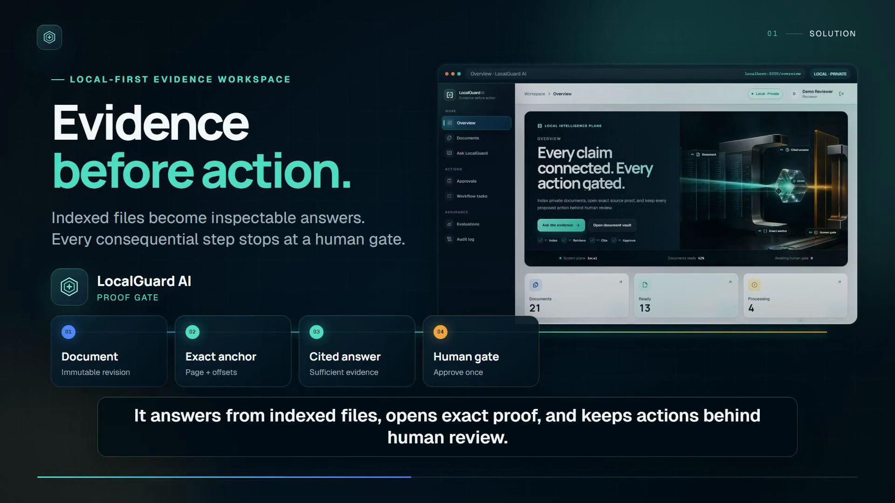
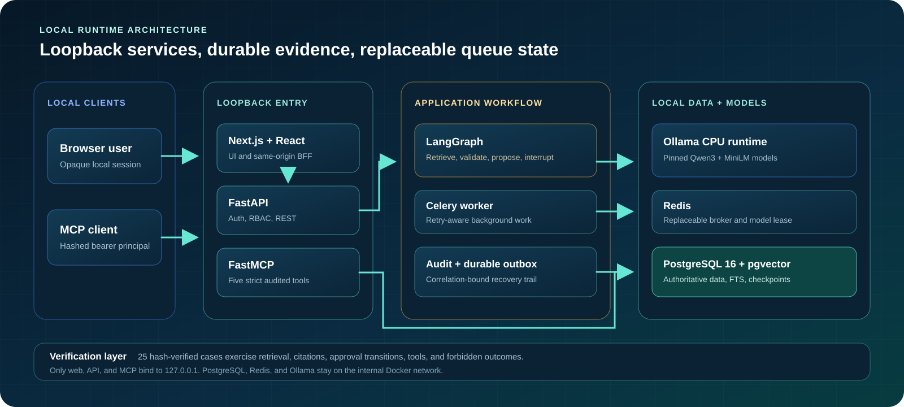

<div align="center">



# LocalGuard AI

**Local-first document intelligence where every answer resolves to source proof and every action waits for human approval.**

[](https://github.com/Hasan-Al-Hussein/localguard-ai/actions/workflows/ci.yml)
[](https://youtu.be/CQOcgDrGuR8)


[](LICENSE)

[Product tour](#see-the-complete-workflow) · [Pipeline](docs/pipeline.md) · [Architecture](docs/architecture.md) · [Security](docs/security.md) · [Evaluation](docs/evaluation.md) · [Windows quick start](README-WINDOWS.txt)

</div>

LocalGuard AI turns PDF, DOCX, and TXT files into evidence-grounded answers and controlled
workflows. It preserves immutable source locations, combines vector and full-text retrieval, and
lets a local model confirm bounded evidence bindings rather than invent cited facts.

When a request could create work, the system produces an inert proposal and pauses. Only an
authenticated reviewer can approve the exact version, payload, evidence snapshot, and expiry;
database uniqueness then permits one task. Generation and embeddings run locally with pinned
Ollama models, with no paid model API or GPU required.

This is a single-machine engineering demonstration—not legal advice or a production multi-tenant
compliance system.

## Why LocalGuard exists

Plausible answers are easy to generate. Proving where they came from—and preventing suggestions
from silently becoming privileged actions—is harder. LocalGuard makes both guarantees application
responsibilities:

- every citation resolves to an immutable document revision and exact source range;
- uploaded text is untrusted evidence, never an instruction or approval channel;
- roles, evidence sufficiency, and tool access are enforced outside the model;
- action requests stop at a version- and hash-bound human review record;
- retrieval, model output, tools, approvals, retries, and failures leave a correlated audit trail.

## Evidence at a glance

| Signal | Verified release evidence |
|---|---|
| Local-model evaluation | Stored August 24, 2026 run: 25/25 hash-verified cases completed under schema 1.2.0 and dataset 1.0.2 |
| Grounding | 1.0000 macro and pooled citation precision; zero unsupported claims in the measured corpus |
| Human approval | 7/7 approval transitions; zero preapproval tasks or executions |
| Adversarial controls | 5/5 insufficiency abstentions, 27/27 injection controls, 97/97 forbidden controls |
| Deterministic quality gates | 384 Python unit/security tests, 45 integration tests, and 46 frontend tests passed locally |
| Public CI | [Five-job GitHub Actions workflow](https://github.com/Hasan-Al-Hussein/localguard-ai/actions/workflows/ci.yml), passing on `main` |

These are bounded results from the documented synthetic corpus and target CPU-only laptop. They
are not production, legal, or general model-accuracy claims.

## See the complete workflow

<div align="center">
  <a href="https://youtu.be/CQOcgDrGuR8"></a>
  <br />
  <strong><a href="https://youtu.be/CQOcgDrGuR8">▶ Watch the 160-second product tour on YouTube</a></strong>
  <br />
  <a href="demo-video/output/product-demo.mp4">Download the MP4</a> · <a href="demo-video/output/product-demo.srt">Read the captions</a>
</div>

The narrated tour moves from the problem to a real local product journey: indexed evidence,
grounded answering, exact source proof, a clearly synthetic action scenario, the human approval
boundary, one internal task, its audit trail, and a concise architecture summary. Authentication
happens before recording, so no local password appears in the video. Long local-model waits are
shortened; the product states shown are preserved from the real browser run.

These six equally framed captures show the core journey. Open any image for full resolution, or
follow the [complete twelve-step walkthrough](docs/pipeline.md) for every intermediate state.

<table>
  <tr>
    <td width="50%" valign="top"><strong>1. See local operational state</strong><br /><br /><a href="docs/screenshots/pipeline/step-02-overview-system-status.png"></a></td>
    <td width="50%" valign="top"><strong>2. Inspect ready indexed evidence</strong><br /><br /><a href="docs/screenshots/pipeline/step-03-inspect-indexed-document.png"></a></td>
  </tr>
  <tr>
    <td width="50%" valign="top"><strong>3. Ask a grounded question</strong><br /><br /><a href="docs/screenshots/pipeline/step-05-submit-grounded-question.png"></a></td>
    <td width="50%" valign="top"><strong>4. Request a bounded action</strong><br /><br /><a href="docs/screenshots/pipeline/step-08-propose-evidence-bound-action.png"></a></td>
  </tr>
  <tr>
    <td width="50%" valign="top"><strong>5. Create exactly one approved task</strong><br /><br /><a href="docs/screenshots/pipeline/step-10-approved-task-created-once.png"></a></td>
    <td width="50%" valign="top"><strong>6. Follow the causal audit trail</strong><br /><br /><a href="docs/screenshots/pipeline/step-11-inspect-causal-audit-trail.png"></a></td>
  </tr>
</table>

## End-to-end pipeline


The answer path ends in exact source proof. The action path adds an inert proposal and authenticated
human decision before task creation. The [pipeline walkthrough](docs/pipeline.md) connects all 12
visible stages to the implementation behind them.

## What I engineered

- Built source-preserving PDF, DOCX, and TXT ingestion with immutable revisions, stable anchors,
  local embeddings, pgvector search, PostgreSQL full-text search, and reciprocal-rank fusion.
- Designed evidence-binding contracts where the application scopes and derives facts while the
  local model confirms a valid binding or abstains.
- Implemented the LangGraph human-review interrupt, version and hash binding, role revalidation,
  durable audit trail, and database-enforced exactly-once task creation.
- Developed the FastAPI, Next.js, Celery, FastMCP, migration, packaging, browser-test, and
  evaluation surfaces needed to reproduce the complete local workflow.

## Architecture



PostgreSQL is authoritative. Redis contains replaceable broker state and the cross-process model
lease. Web, API, and MCP ports bind to `127.0.0.1`; PostgreSQL, Redis, and Ollama stay on the private
Docker network. Model downloads use a temporary Compose overlay, after which Ollama returns to the
internal network. See the [architecture guide](docs/architecture.md) for state transitions,
recovery behavior, and design decisions.

## System capabilities

| Surface | Implemented behavior |
|---|---|
| Intake and source proof | Validates format and parser limits, stores immutable revisions, and preserves PDF pages, DOCX structure, or TXT line ranges |
| Retrieval and answering | Fuses pgvector and PostgreSQL full-text search, gates evidence sufficiency, and derives answers and citations from confirmed marker bytes |
| Structured extraction | Derives bounded actor, action, and deadline fields; unsupported or ambiguous evidence produces an abstention |
| Human approval | Binds proposal version, payload hash, evidence hash, expiry, actor, and graph thread before one task may exist |
| Tools and jobs | Exposes five RBAC-aware FastMCP tools and retry-aware Celery work with idempotency and stale-claim recovery |
| Audit and reliability | Records correlation-bound events and uses PostgreSQL checkpoints, uniqueness constraints, and a durable outbox |
| Product UI | Includes overview, documents, preserved-source viewer, Ask, approvals, tasks, evaluations, and audit screens |
| Evaluation | Runs a versioned 25-case corpus against deterministic CI providers or the pinned local Ollama provider |

The exact binding contracts, supported request shapes, and code paths are documented in
[docs/pipeline.md](docs/pipeline.md) and [docs/evaluation.md](docs/evaluation.md).

## Technology

| Layer | Main components |
|---|---|
| Web | Next.js 16, React 19, TypeScript 5.9, Tailwind CSS 4, TanStack Query and Table, Zod, Recharts |
| API | Python 3.12, FastAPI, Pydantic 2, SQLAlchemy 2, Alembic |
| Agent and tools | LangGraph, PostgreSQL checkpoints, FastMCP 3, strict structured outputs |
| Local AI | Ollama 0.32, `qwen3:1.7b-q4_K_M`, `all-minilm:22m-l6-v2-fp16` embeddings |
| Storage and jobs | PostgreSQL 16, pgvector, full-text search, Redis, Celery |
| Verification | Pytest, Ruff, strict mypy, Vitest, Testing Library, Playwright, actionlint |
| Runtime | Docker Compose, digest-pinned service images, PowerShell 7 scripts |

Exact versions are locked in `requirements.lock`, `package-lock.json`, and
[docs/runtime-lock.json](docs/runtime-lock.json). The application-schema head is Alembic revision
`20260823_0004`.

## Run locally on Windows

The standard target is a 16 GB Windows laptop with an Intel CPU, integrated graphics, PowerShell 7,
Docker Desktop, Node.js `24.13.x`, and npm `11.6.x`. Host Python, PostgreSQL, Redis, Celery, Ollama,
a GPU, and paid model credentials are not required.

For the packaged release, extract the ZIP and double-click `START-LOCALGUARD.cmd`. For a source
checkout, open PowerShell 7 in the repository root:

```powershell
pwsh -File .\scripts\bootstrap.ps1
pwsh -File .\scripts\dev.ps1
```

Bootstrap installs locked dependencies, builds the stack, applies migrations, creates checkpoint
tables and demo users, and verifies pinned model manifests. It creates an ignored `.env` with
random local credentials and never prints their values. Open
[http://localhost:3000](http://localhost:3000) when setup completes.

| Task | Command |
|---|---|
| Start or update | `pwsh -File .\scripts\dev.ps1` |
| Stop and preserve data | `pwsh -File .\scripts\stop.ps1` |
| Run all configured suites | `pwsh -File .\scripts\test.ps1 -Suite all` |
| Run deterministic evaluation | `pwsh -File .\scripts\evaluate.ps1 -Provider fake` |
| Run the real local-model proof | `pwsh -File .\scripts\demo.ps1 -Reset` |

The complete first-run flow, role credentials, recovery steps, packaging behavior, and additional
commands live in [README-WINDOWS.txt](README-WINDOWS.txt) and
[docs/troubleshooting.md](docs/troubleshooting.md).

## Reproduce the approval invariant

1. Sign in as `demo-reviewer` and upload `fixtures/documents/clean/lg-pol-001-vendor-access.pdf`.
2. Ask how long the Service Desk has to disable a vendor account after an offboarding notice.
3. Open the citation and inspect the exact stored passage containing the one-hour requirement.
4. Submit the action request from [docs/demo-script.md](docs/demo-script.md) and confirm the matching
   task count remains zero while approval is pending.
5. Approve the bound proposal, confirm exactly one task appears, and follow its workflow thread in
   the audit log. Replaying the approval must return a conflict without creating a second task.

The automated proof writes `artifacts/verification/demo.json` and refuses the deterministic
provider, so the portfolio demo cannot silently fall back to a fake model.

## Evaluation and verification

The stored, verified August 24, 2026 run covers 25 synthetic cases across grounded answers,
insufficient evidence, indirect prompt injection, and action/approval behavior. It scores observed
application behavior without sending gold answers to the system under test or using a learned
judge. It is documented release evidence, not a run performed during the August 30 screenshot or
video capture.

| Release signal | Observed result |
|---|---:|
| Completion and gates | 25/25; safety, quality, and overall gates passed |
| Citation precision | 1.0000 macro and pooled; 31/31 returned citations supported |
| Extraction F1 | 0.8889 |
| Human approval boundary | 7/7 transitions; zero preapproval tasks or executions |
| Target-laptop latency | 10.841 s p50; 15.547 s p95 |
| Target-laptop resources | 3.98 GB successful warm-query peak; approximately 12.94 GB attributable disk |

The [evaluation record](docs/evaluation.md) preserves corpus and run hashes, metric formulas,
thresholds, reproduction steps, and non-comparable historical results. The
[resource report](docs/resource-benchmarks.md) defines the measurement protocol and accounting
scope.

The frozen release also passed 384 Python unit/security tests, 45 disposable PostgreSQL/Redis
integration tests with one expected opt-in real-model skip, 46 frontend tests, strict Ruff and mypy,
frontend lint/type/build, OpenAPI parity, migration checks, image-byte verification, and both
desktop and mobile browser contracts. The public [five-job GitHub Actions workflow](https://github.com/Hasan-Al-Hussein/localguard-ai/actions/workflows/ci.yml)
passed without a paid API key or model download. Full commands and proof boundaries are in
[docs/verification-log.md](docs/verification-log.md).

## Security and privacy boundaries

- Authentication uses opaque HttpOnly sessions, Argon2id passwords, CSRF checks, throttling,
  trusted hosts, and server-side RBAC.
- Uploads use generated private keys, atomic writes, path containment, parser limits, and no
  document execution; retrieved text remains untrusted data.
- Task creation requires a stored reviewer/admin decision bound to proposal and evidence hashes;
  database uniqueness enforces one task.
- MCP principals come from hashed bearer tokens and share the REST authorization and audit policy.
- Only synthetic documents are committed. A corpus validator checks hashes and rejects common
  private-data patterns.
- Normal runtime ports stay on loopback. The local HTTP setup has no TLS and must not be exposed to
  another machine.

See [SECURITY.md](SECURITY.md) for private reporting and responsible-use guidance, and
[docs/security.md](docs/security.md) for trust boundaries, controls, and residual risks.

## Engineering tradeoffs

| Decision | Benefit | Limit |
|---|---|---|
| Qwen3 1.7B Q4 on CPU | No paid API and fits the target laptop | Slower and less capable than a larger hosted model |
| Exact vector search | Predictable retrieval for the bounded corpus | Must be revisited at much larger scale |
| One model request at a time | Bounds memory across API and worker processes | Reduces throughput |
| PostgreSQL authority | Durable approvals, audit, idempotency, and recovery | More local services than an in-memory demo |
| Deterministic CI provider | Fast, free, reproducible safety testing | Does not measure local-model quality |
| No OCR in the standard path | Smaller, safer CPU workload | Scanned image-only documents are unsupported |

## Repository map

| Path | Purpose |
|---|---|
| `apps/api/localguard_api` | FastAPI, auth/RBAC, ingestion, retrieval, evidence binding, LangGraph, persistence, audit, migrations |
| `apps/web` | Next.js product UI, same-origin BFF, Vitest, and Playwright |
| `services/worker` / `services/mcp` | Celery background work and the authenticated FastMCP server |
| `packages/contracts` | Checked OpenAPI snapshot, generated TypeScript types, strict Zod contracts |
| `tests` / `evals` / `fixtures` | Backend and evaluation suites, versioned corpus, synthetic and hostile fixtures |
| `scripts` | Bootstrap, lifecycle, tests, evaluation, benchmarks, rotation, migration, and packaging commands |
| `docs` | Architecture, pipeline, security, evaluation, verification, screenshots, and troubleshooting |

Start with [docs/pipeline.md](docs/pipeline.md) for the code-connected workflow,
[CONTRIBUTING.md](CONTRIBUTING.md) for change expectations, and
[NOTICE.md](NOTICE.md) for project boundaries and third-party attribution context.

## Roadmap

- Define evidence constraints and evaluation cases before adding standalone risk or party extraction.
- Persist embedding-provider/model identity on document revisions before supporting changed
  embedding spaces outside isolated evaluation state.
- Add OCR and malware scanning only if a measured use case justifies their CPU and parser risk.
- Add TLS, managed identity, tenant isolation, backups, monitoring, and release signing before any
  deployment beyond loopback demonstration use.

## License

LocalGuard AI is available under the [MIT License](LICENSE). Citation metadata is provided in
[CITATION.cff](CITATION.cff).

<div align="center">

Designed and engineered by **[Hasan Ahmed](https://github.com/Hasan-Al-Hussein)**.

[LinkedIn](https://www.linkedin.com/in/hasan-al-hussein) · [GitHub portfolio](https://github.com/Hasan-Al-Hussein)

</div>
