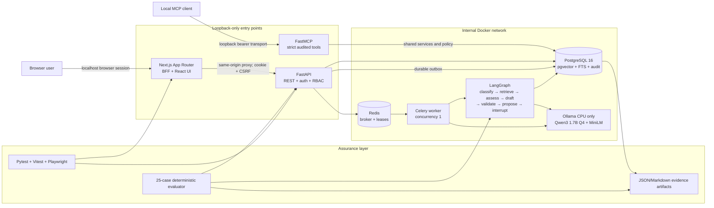
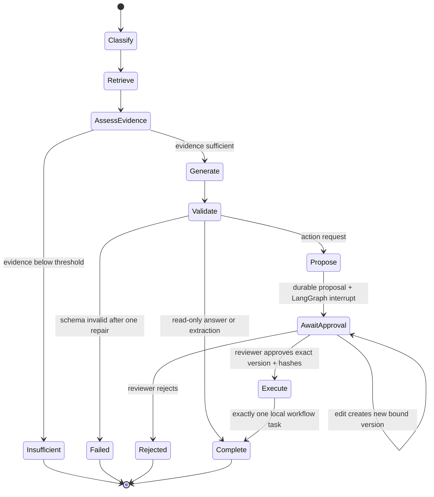

# LocalGuard AI architecture

LocalGuard AI is a local-first document intelligence application built around one rule: model
output is a draft, while application code owns identity, permissions, evidence, approval, and
state changes. The standard Windows setup uses Docker Desktop for every runtime service and uses
host Node.js/npm only for the reproducible frontend contract and test commands. It does not require
a host Python, PostgreSQL, Redis, or Ollama installation.

## System view

Only ports 3000, 8000, and 8001 are published, and each binds to `127.0.0.1`. PostgreSQL,
Redis, and Ollama are not host-published. The backend network is internal: database, broker, model,
and worker live there; API and MCP bridge it to edge. The web container joins edge only and cannot
resolve the database service. Edge is deliberately non-internal because Docker Desktop needs it for
loopback port publishing. Consequently, the topology limits inbound reachability but does not
firewall outbound traffic from edge-connected web, API, or MCP containers. A temporary Compose
overlay is used for the intentional model-download step, and normal application code has no cloud
provider fallback.

The shared backend environment explicitly blanks PostgreSQL and bootstrap credentials for API,
worker, and MCP. The database receives only its PostgreSQL settings; only the short-lived
`admin-cli` container receives demo passwords and the MCP bootstrap bearer for seed, synchronization,
and rotation commands.

## Main data flow

### Ingestion

1. FastAPI authenticates the opaque database session, verifies the synchronizer CSRF token, and
   validates the declared extension, detected media type, byte limit, and format-specific limits.
2. The source is written atomically under a generated private storage key. The original filename
   is metadata, never a path.
3. One transaction records the document revision, an audit event, and a durable outbox event.
   A broker outage therefore cannot strand an accepted upload.
4. The Celery worker parses PDF pages, DOCX heading/paragraph spans, or original TXT line ranges.
   Chunks never cross a source anchor.
5. The worker obtains the cross-process model lease, requests 384-dimensional local embeddings,
   writes pgvector rows, and marks the revision ready. Text that exceeds MiniLM's effective
   context is split without truncation, embedded in bounded batches, length-weight pooled, and
   L2-normalized; the provider verifies that the segments reconstruct the full input. Task replay
   is idempotent.

### Cited question answering

1. A question request is normalized and bound to its actor, idempotency key, payload hash, and
   correlation ID in the same transaction as its outbox event.
2. Retrieval fans out to exact cosine search and PostgreSQL full-text search, then combines ranks
   with reciprocal-rank fusion. Absolute vector/text relevance thresholds prevent rank alone from
   turning unrelated text into “sufficient” evidence.
3. The model receives delimited, explicitly untrusted evidence and may cite only opaque chunk IDs
   from the retrieved allowlist.
4. Pydantic validates the structured response. One bounded repair is permitted; a second invalid
   response fails closed.
5. The server resolves each accepted citation to an immutable document revision, anchor, quote,
   and character range. The browser deep link carries that identity rather than reopening whichever
   revision happens to be current.

### Evidence-derived structured output

Evaluator schema `1.2.0` uses three application-owned evidence contracts:

- `qa-fact-binding-v1` scopes exact marker-local QA bindings. The model confirms the opaque binding
  set or abstains; application code derives the answer, normalized claims, and citation spans.
- `evidence_derived_binding_confirmation_v2` scopes the full supported structured-extraction
  binding set from exact evidence. The model confirms the complete set or abstains; application
  code derives the finding fields.
- `evidence_derived_binding_selection_v2` scopes action candidates. The model selects exactly one
  evidence binding or abstains; application code derives the claim and proposal fields.

The model does not author or partially rewrite derived factual fields in these contracts. Standalone risk
extraction and standalone party/responsible-party extraction are unsupported and remain roadmap
work requiring their own schemas, evidence rules, and evaluation cases.

### Agent workflow and approval

The proposal binds its immutable version, canonical payload hash, evidence snapshot hash, expiry,
and workflow thread. Approval is a reviewer/admin API operation—not a phrase the model or document
can emit. The worker rechecks the actor’s current role and every binding under row locks before a
unique task can be inserted.

`propose_workflow_task` enters through a narrower MCP-direct route. It resolves cited chunks,
computes the same canonical payload and evidence hashes, takes a provenance-derived advisory lock,
and deduplicates an actor's matching pending proposal. The resulting run is marked with the
`mcp_direct_workflow_action` intent; it does not fabricate a LangGraph checkpoint. On a human
decision, the worker accepts the dedicated direct-resume path only for that provenance marker and
then invokes the same approval service used by the graph path. Version/hash/current-evidence and
current-reviewer checks still run under row locks, and database uniqueness still makes task
creation exactly once.

## Persistence and recovery

PostgreSQL is authoritative. Redis holds only replaceable broker state and a serialized model
lease. The important tables fall into five groups:

| Group | Tables and responsibility |
|---|---|
| Identity | users, sessions, login throttles, hashed MCP access tokens |
| Documents | documents, immutable revisions, source anchors, chunks with vector embeddings |
| Questions | question jobs, answers, server-resolved citation snapshots |
| Workflows | runs, extracted findings, versioned proposals, decisions, approved tasks |
| Reliability | audit events, acknowledged outbox events, cleanup ledger |
| Graph history | externally managed LangGraph checkpoint writes, blobs, checkpoints, and migration metadata |

Two reconciliation loops run in the API process. The outbox loop claims pending events, dispatches
with a stable event UUID as the Celery task ID, and records a dispatched lease. A worker ACKs the
row only when PostgreSQL confirms that delivery's domain transition is complete, including an
approval interrupt as completion of a workflow-start delivery. If delivery is never acknowledged,
the lease expires and the reconciler safely presents the same work again; broker-send failures are
released with bounded backoff. Transient ingestion, question, and workflow errors reset
authoritative state for Celery's next retry and become terminal only on the final attempt. The
cleanup loop separately retries private-file deletion after database state has been hidden and
relational evidence has been cleaned. Claims use row locking, skip-locked semantics, and
stale-claim recovery so multiple processes do not intentionally perform the same work concurrently.

LangGraph’s four checkpoint tables are created by the pinned checkpoint library through an
explicit setup command. Alembic owns the application schema and deliberately ignores those
externally versioned tables, which keeps drift checks meaningful. An Alembic downgrade therefore
does not remove graph history. `purge-checkpoints` is a separate destructive retention operation;
it requires the exact confirmation text and deletes user-thread writes, blobs, and checkpoints
while preserving the checkpoint schema and its migration metadata.

Alembic head is `20260823_0004`. The c57 Phase 2 upgrade derives each document's source hash and
handles Phase 1 duplicates before installing the active-document uniqueness index: it keeps the
earliest `(created_at, id)` row active, marks later rows deleted, and writes a deterministic
`migration.document_duplicate_quarantined` audit containing the canonical ID and previous state.
The duplicate revisions and private files remain referenced, allowing c57 downgrade to restore the
rows and mark those migration audits reverted. Revision `20260823_0003` then reconciles development
databases stamped by a pre-final c57 shape; its downgrade is intentionally a no-op because it only
normalizes that historical drift. Revision `20260823_0004` persists each structured finding's exact
marker IDs, actor/action/deadline fields, and evidence-normalizer provenance. Its downgrade refuses
to drop those columns while any finding contains v2 evidence metadata.

Citation rows retain immutable title/revision/anchor/quote/range snapshots after source deletion,
and their chunk foreign key becomes null. Phase 1 cannot represent such an orphan snapshot. The
c57 downgrade counts these rows and fails closed until an operator exports them with
`export-orphan-citations` and separately confirms their purge with the exact
`PURGE ORPHAN CITATIONS` phrase.

## Trust boundaries

| Boundary | Enforced controls |
|---|---|
| Browser → Next BFF | same-origin paths, bounded bodies, narrow forwarded headers, sanitized errors |
| BFF → FastAPI | HttpOnly SameSite session, in-memory CSRF token, trusted hosts, exact CORS origin |
| Uploaded file → parser | MIME/extension agreement, byte/page/entry/expansion limits, no execution |
| Document text → model | untrusted delimiters; no identity, permission, tool, or approval authority |
| Model → application | schema 1.2.0 evidence-binding confirmation/selection, citation allowlist, application-derived fields, one repair only |
| User → privileged action | backend RBAC, CSRF, version/hash/expiry binding, durable human decision |
| MCP client → tools | hashed bearer principal, tool allowlist, strict schemas, shared RBAC and audit |
| API → asynchronous work | transactional outbox; dispatched lease; terminal ACK; retry-safe workers |

Audit correlation is intentionally a reference chain rather than a foreign-key chain. API-side
events can use an outbox event or decision UUID as `causation_id`. Each worker invocation creates a
new `worker-...` correlation, while its `causation_id` currently stores the originating request
correlation reference. Consumers must not assume every causation value is an audit-event UUID.

Detailed controls and residual risks are documented in `docs/security.md`.

## Resource-aware decisions

- Qwen3 1.7B Q4 was selected by a real local schema/grounding gate over the slower Qwen2.5 1.5B
  candidate; the comparison model was removed after measurement.
- Generation and embedding share one Redis-backed lease. Ollama and Celery also enforce
  concurrency one, so the 16 GB laptop is not surprised by overlapping model loads.
- Exact pgvector search is intentional for the small portfolio corpus. An approximate index would
  add tuning and recall risk without a measured benefit.
- OCR, multimodal processing, external telemetry, cloud APIs, Kubernetes, Kafka, and optional
  tracing stacks are outside the standard runtime.
- Containers have explicit memory limits, and model/data volumes live outside the OneDrive working
  tree.

## Repository boundaries

| Path | Owns |
|---|---|
| `apps/web` | browser UI, same-origin proxy, accessibility, browser tests |
| `apps/api/localguard_api` | HTTP policy, domain services, retrieval, providers, LangGraph |
| `services/worker` | Celery adapters around idempotent domain operations |
| `services/mcp` | FastMCP transport and strict audited tool adapters |
| `packages/contracts` | generated OpenAPI types plus runtime Zod contracts |
| `evals` and `fixtures` | hash-locked synthetic corpus, gold cases, metrics and reports |
| `scripts` | Windows-first bootstrap, run, test, evaluation, demo, and evidence commands |

The accepted architecture decisions are also recorded individually in `docs/adr/` so future
changes can state which boundary they replace and why.
